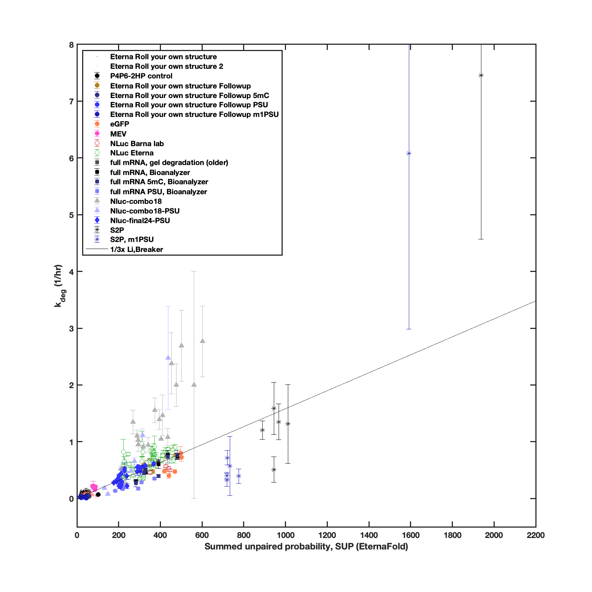

# RNA-deg-rates from the OpenVaccine project

## What this is
Calibration data for models of RNA degradation.

* Overall hydrolysis rates for RNA molecules in units of 1/hr. 
* Several experimental methods used and a wide length range; see notes on data sources below.
* Data were acquired by Ann Kladwang and analyzed by R. Das and Do Soon Kim as part of the **OpenVaccine** initiative.
* All measurements taken under _accelerated_ degradation conditions 10 mM MgCl2, 50 mM Na-CHES, pH 10 in the Das laboratory at Stanford University. Note that Mg(2+) ions and high pH all serve to accelerate degradation; conditions may mimic environment of RNA in some cationic formulations. Conditions ensured experiments could be completed in 24 hrs; rates measured under other conditions (no Mg2+, lower pH) correlate well.
* Measurements acquired at ambient temperature of ~24 °C; note that due to unexpected laboratory temperature fluctuations, temperature may have varied between 22 to 25 °C, which may give rise to variations in overall modification rate between different days. 

Contact Rhiju Das (rhiju [at] stanford.edu) with any questions.

## Files
* `RNA_deg_rates.csv`: compilation of data, error estimates, RNA sequences, and start/end positions over which to sum per-nucleotide predictions,  predictions from one model (EternaFold SUP; see below).
* `prepare_data/`: archive of data and prediction files, and MATLAB script `rhiju_make_master_plot_script.m` used to assemble the data file.  

## Example of model fit

Model plotted above is:  

* EternaFold secondary structure ensemble (EternaFold is Contrafold-SE with parameters retrained based on data sets collected on Eterna; note no overlap of those training data with the degradation data here). See [this paper](https://www.biorxiv.org/content/10.1101/2020.05.29.124511v2.full).  
* Predictions are summed unpaired probability (SUP), as described in [this paper](https://doi.org/10.1093/nar/gkab764). Note that sum is not necessarily over entire RNA. For experimental readouts that are based on reverse transcription-PCR, the observed degradation rates reflect degradation over only the window that is encompassed by the primer pairs. (These positions are given here as `start_pos` and `end_pos` in the data files). 
* The proportionality constant plotted is 1/3 of the one predicted by the model of Li and Breaker at 10 mM Mg(2+), 25 °C, 25 mM monovalents (7.91E-05/nt/hr). 

## Data sources

The experiments have largely been described and archived elsewhere, and involve 5 different experimental methods.

* `Eterna Roll your own structure` data are based on the In-line-seq protocol, run on Illumina Next-Seq instruments, described in Fig. 3 of the [Leppek et al., 2021](https://www.biorxiv.org/content/10.1101/2021.03.29.437587v1.full). Single-nucleotide-resolution data are available on the [RNA Mapping Database](https://rmdb.stanford.edu/detail/RYOS1_MGPH_0000) and were the public training and leaderboard data in the Kaggle Open Vaccine challenge, described in [Wayment-Steele et al., 2021c](https://arxiv.org/pdf/2110.07531.pdf). The data in this archive are the summed degradation rates over the nucleotides probed in In-line-seq, without any further normalization except to convert to rates (per hour); note that the RMDB data _were_ normalized. These summed degradation rates correlate quite well with estimates based on 'drop out' of full-length RNA's from the In-line-seq experiment (unpub. analysis, R.D.)
* `Eterna Roll your own structure 2` are similarly summed In-line-seq degradation rates provided private leaderboard data forthe Kaggle Open Vaccine challenge, described in [Wayment-Steele et al., 2021c](https://arxiv.org/pdf/2110.07531.pdf). 
* `P4P6-2HP control`,`Eterna Roll your own structure Followup`,`Eterna Roll your own structure Followup 5mC`,`Eterna Roll your own structure Followup PSU`,`Eterna Roll your own structure Followup m1PSU` are based on in-line hydrolysis profiles read out through capillary electrophoresis assays (ABI 3130), using a protocol analogous to the one in [Kladwang et al., 2014](https://daslab.stanford.edu/site_data/pub_pdf/2014_Kladwang_Biochem.pdf) though without any normalization.
*  `eGFP`, `MEV`,`NLuc Barna lab`,`NLuc Eterna` are degradation rates for molecules in the PERSIST-seq in solution stability measurements in Fig. 3 of [Leppek et al., 2021]; see also Table S1.
* `full mRNA, gel degradation (older)` are (previously) unpublished data for RNA degradation rates measured through conventional PAGE gels and ImageJ analysis.
* `full mRNA, Bioanalyzer`,`full mRNA 5mC, Bioanalyzer`,`full mRNA PSU, Bioanalyzer`  are degradation rates based on running RNA through capillary electrophoresis measurements on Agilent Bioanalyzer instruments; see last panels of Fig. 3 of [Leppek et al., 2021](https://www.biorxiv.org/content/10.1101/2021.03.29.437587v1.full). See also [repo of analysis scripts](https://github.com/DasLab/openvaccine-CE-analysis).
* `Nluc-combo18`, `Nluc-combo18-PSU`,`Nluc-final24-PSU` are measurements on 'mix-and-match' combinations of CDS and UTR's described in Fig. 4 of [Leppek et al., 2021](https://www.biorxiv.org/content/10.1101/2021.03.29.437587v1.full). The last set of measurements ('final 24 nanoluciferase') are in Table S5 of the paper. 
*  `S2P, m1PSU`, `S2P` 

